**Advanced Lane Finding Project**

This project uses computer vision techniques to detect lane information from a car's front-facing camera. From an input video clip, it produces an output video marked and annotated with lane info. I completed this project as part of Udacity's Self-Driving Car nanodegree program.

There are two distinct layers of processing: a lane-finding pipeline for single images, and a video layer that leverages temporal coherence (i.e. detections from previous frames) to smooth the output and optimize the performance of the single image layer. 

# Single Image Processing

The single image processing pipeline can be summarized as follows:

* Compute the camera calibration parameters.
* Undistort raw image.
* Detect lane separator "candidate pixels".
* Generate a bird's-eye view of the candidate pixels.
* Find the left and right lane separator lines in the bird's-eye view
* Determine the curvature of the lane and vehicle position with respect to center.
* Perform a confidence check on the detection
* Annotate original image with lane boundaries and other info

The source code can be found in [lane_finder.py](./lane_finder.py); [Here is the main function](lane_finder.py#L378-L428).

I was inspired by TODO to create an interactive UI for tweaking the various parameters contained in this pipeline. Here is a short video demonstrating its use. 

---
Each step is described in detail below.

###Camera Calibration

Before processing an image, we need to account for lens distortion (i.e. fisheye effect from the camera). OpenCV includes utilities for determining a camera's calibration parameters, which quantify how the camera distorts images. Since all the images are taken with the same camera, we only need to do this once.

cv2.calibrateCamera() calculates calibration parameters given a set of 3D points in world space and their corresponding 2D locations in the image. We use a chessboard pattern photographed from several angles to generate input as follows:
* 2D image points are detected by cv2.findChessboardCorners().
* 3D points are generated using a regular grid on the (x,y), with z=0.

| 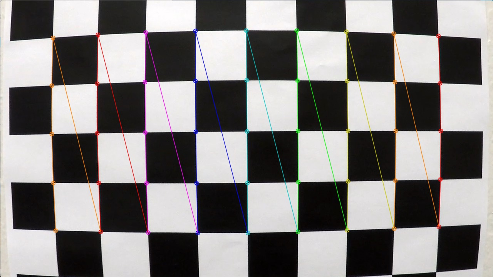        | 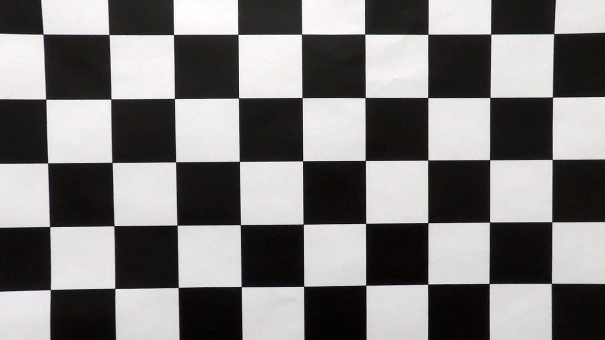        | 
|:-------------:|:-------------:|
| Original with corners detected      | Undistorted |

[Code](./lane_finder.py#L460-L524)

### Undistort raw image
We use cv2.undistort() to undistort the input image using the calibration parameters we calculated:

    cv2.undistort(img, cam_matrix, distortion_coefficients, None, cam_matrix)

| 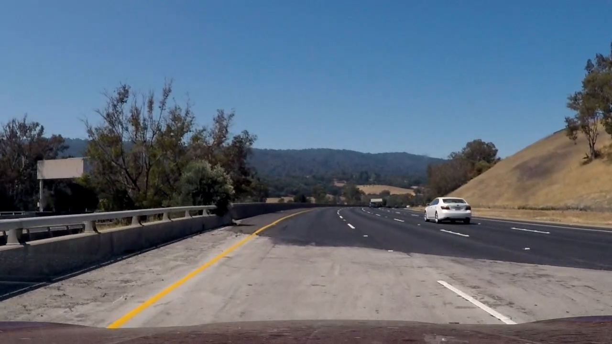        | 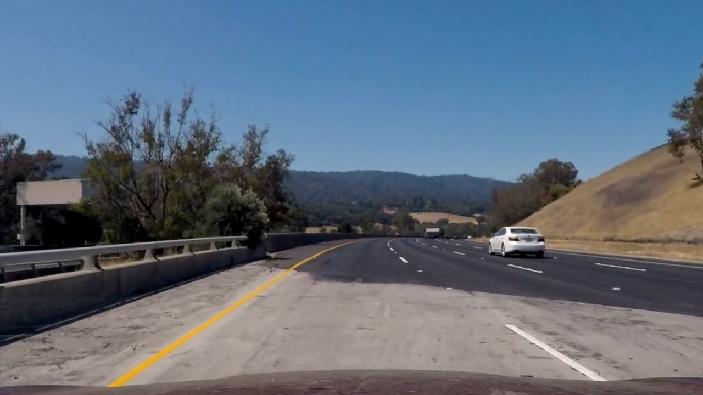        | 
|:-------------:|:-------------:|
| Original      | Undistorted |

[Code](./lane_finder.py#L89-L97)

### Detect lane separator "candidate pixels"
We generate a binary image with pixels that are good bets to be part of the lane separator painted white.

This image is obtained by ORing together three separate images:

| 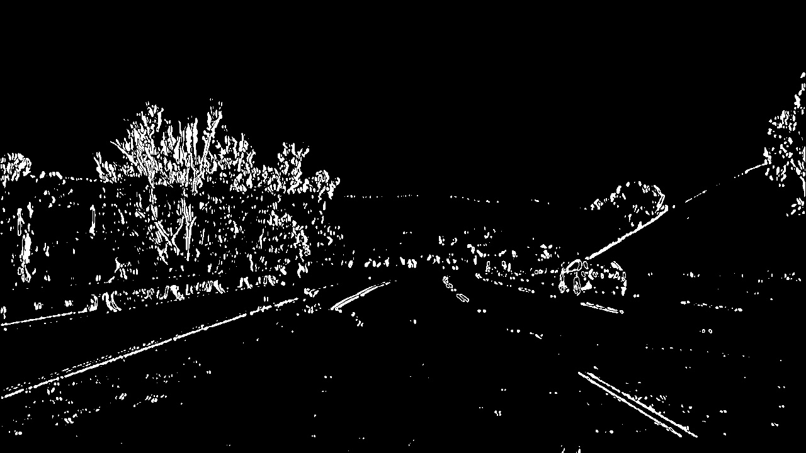        | 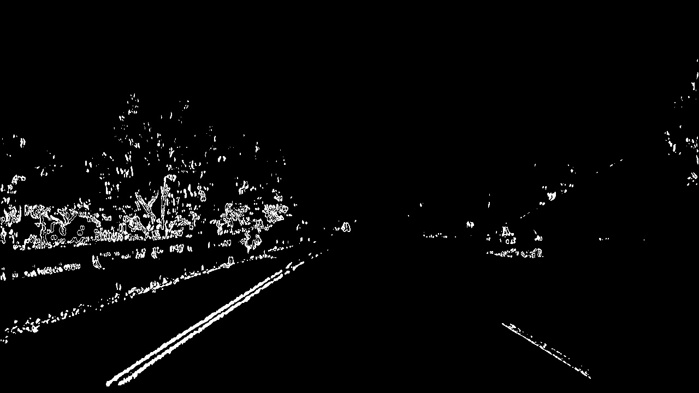        | 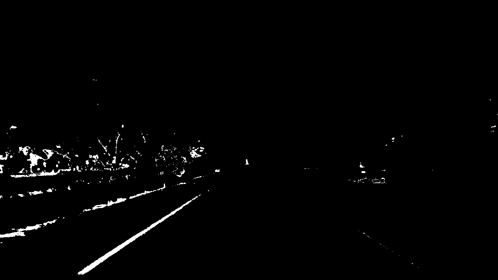 
|:-------------:|:-------------:|:-------------:|
| A thresholded Sobel filter in the X direction on the grayscale image      | A thresholded Sobel filter in the X direction on the S channel of the HLS color space | A threshold on the S channel of the HLS color space |

| 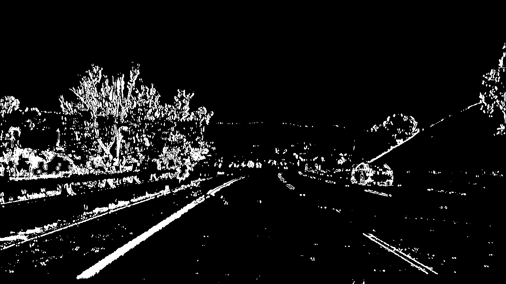        |
|:-------------:|
| 3 images combined with OR      |

Each of these identified some pixels that other components missed, so combining them together yeilded a better detection of candidate pixels. 

This is one of the weaker parts of my pipeline - it does the job on the project video but does not perform well on the challenge videos.

[Code](./lane_finder.py#L392-L396)

### Generate a bird's-eye view

Now we perform a perspective warp on the image from the previous step, to bring it into a bird's eye view that can be used to find the lane lines. OpenCV's cv2.getPerspectiveTransform() can generate such a transformation given a quadrilateral on the source image and its desired location on the destination image:

| 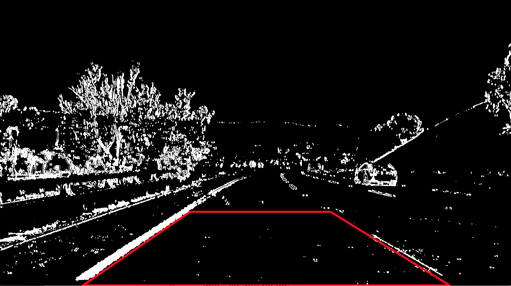        | 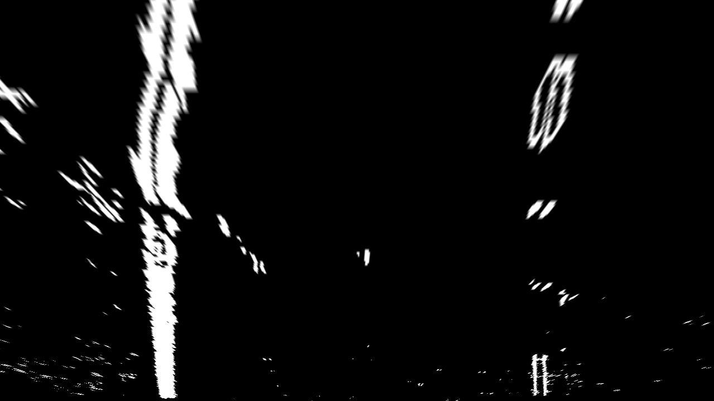        | 
|:-------------:|:-------------:|
| perspective view      | bird's eye view |

The source quadrilateral's points are hard coded into the pipeline based on a measurement of one "vanilla" frame of the video. Unfortunately the location of the source quad is extremely sensitive to small changes in the car's attitute (i.e. small bounces pointing the camera up or down). An incorrect source quad will cause the lane lines to appear skewed in the bird's eye view, which reduces our confidence in the detection: 

| 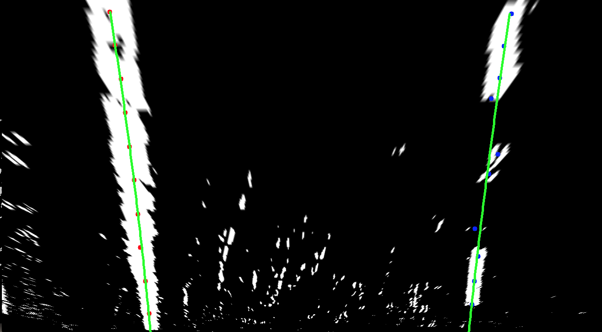       |
|:-------------:|
| Skewed lane lines caused by a bad perspective warp   |

[Code](./lane_finder.py#L152-L199)

### Find the left and right lane lines

Now we search for the left and right lane lines. The algorithm is as follows:
* Generate a histogram along x axis for the bottom of the image
* For each lane line (left and right):
  * Divide the image into ten horizontal bands. From the bottom, for each band:
    * Create search window centered horizontally above the the previous band's detection (or histogram peak for the bottom band)
    * Calculate the center of mass of white pixels in the search window
    * Add the center of mass to the list of points
  TODO: image
  * Fit a second degree polynomial to all the detected points
  TODO: image

[Code](./lane_finder.py#L202-L289)

### Determine the curvature and vehicle position
In order to convert pixel measurements into meters we need to calculate a conversion, by dividing known distances by manually measured pixel distances in the top-down view:

    # meters per pixel in y dimension (9.14m is the distance between dashes on a lane line)
    ym_per_pix = 9.14 / 230 
    # meters per pixel in x dimension (3.7m is the width of a lane)
    xm_per_pix = 3.7 / 640  

The vehicle's position in the lane is determined by comparing the left and right lane line positions to the center of the image:

    def calculate_center_offset(self, image_width):
        pixel_offset = (self.right_line.x_pixels + self.left_line.x_pixels - image_width) / 2
        self.center_offset = pixel_offset * self.left_line.x_meters_per_pixel
        
The curvature radius at a particular point in a polynomial can be calculated using [this method](http://www.intmath.com/applications-differentiation/8-radius-curvature.php):

        self.radius_of_curvature = \
            ((1 + (2 * polynomial[0] * self.bottom_y_meters +
                   polynomial[1]) ** 2) ** 1.5) \
                / np.absolute(2 * polynomial[0])
        
To calculate the curve radius for the lane, we average the left and right curvature radius. This value is only considered valid in the case of a confident detection (see below).

Note that the curvature radius calculation is extremely sensitive to the correctness of the perspective warp, so in practice I found the curve radius to bounce around quite a bit in reaction to minor changes in the car's pitch.

### Perform a confidence check on the detection
To determine whether we are confident in the prediction, we detected lane lines must be:
* Roughly 3.7 meters apart (per US standards)
* Roughly parallel (2nd and 1st order polynomial coefficients are within a threshold). I determined reasonable thresholds by eyeballing a plot of the left and right polynomial coefficients over the length of an entire video clip. See images below.
* Roughly the same curvature radius. Since the turn radius bounces around so much, I considered radii within a factor of 2 to be roughly the same. More confidence in the perspective warp would allow us to tighten that up quite a bit.

 | 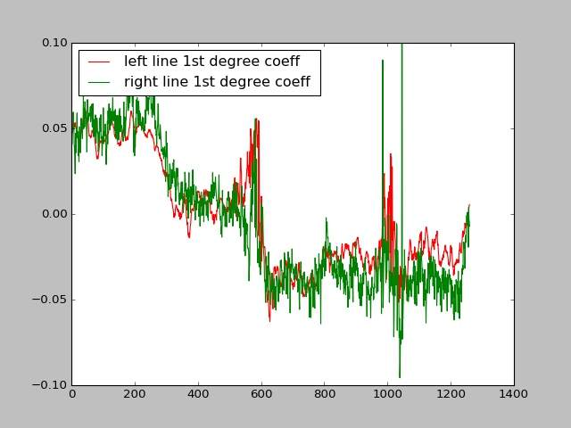        | 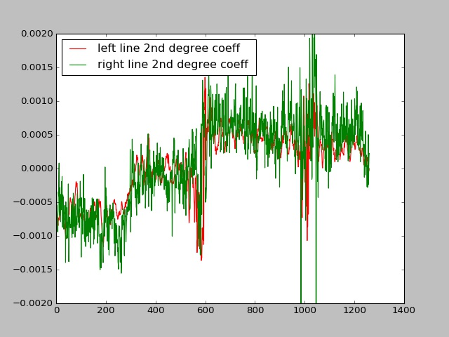        | 
|:-------------:|:-------------:|
| Linear coefficients      | Square coefficients |

Here's a plot of the confidence determination for each of these factors over the course of the video clip:

| 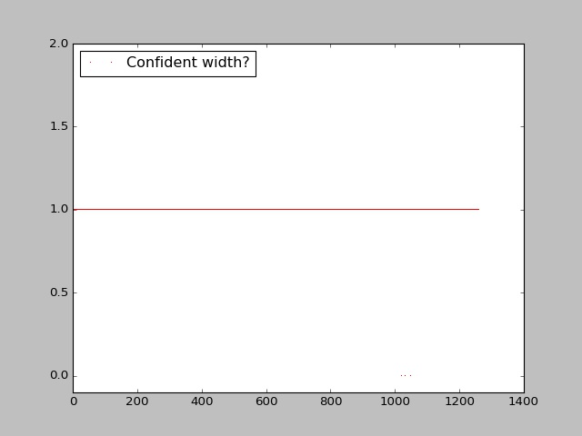        | 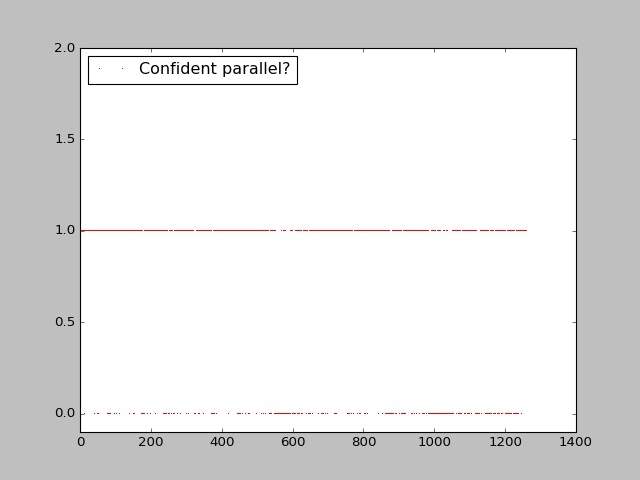        | 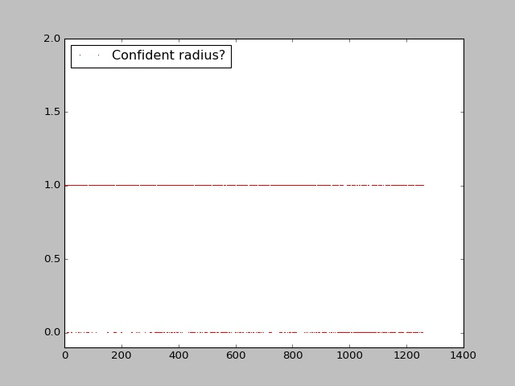 |
|:-------------:|:-------------:|:-------------:|
| Reasonable lane width?      | Roughly parallel? | Same curve radius? |

| 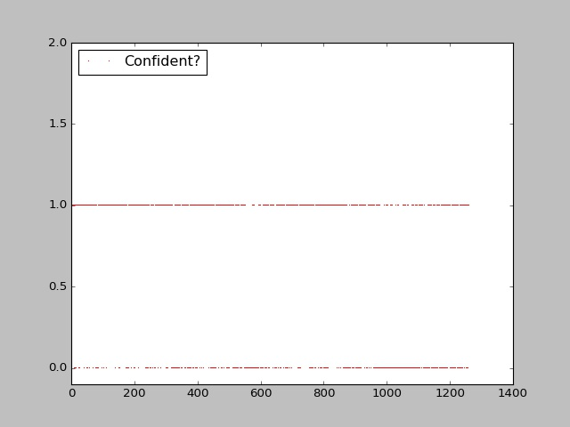       |
|:-------------:|
| Overall confidence (width AND parallel AND radius)   |

[Code](./lane.py#L75-L100)

### Warp back onto the original image.
We filled the region between the left and right lane lines, and warp it back as if it is seen from the front-facing camera (again using cv2.getPerspectiveTransform() but this time with reversed source and destination quadrilaterals)

 | 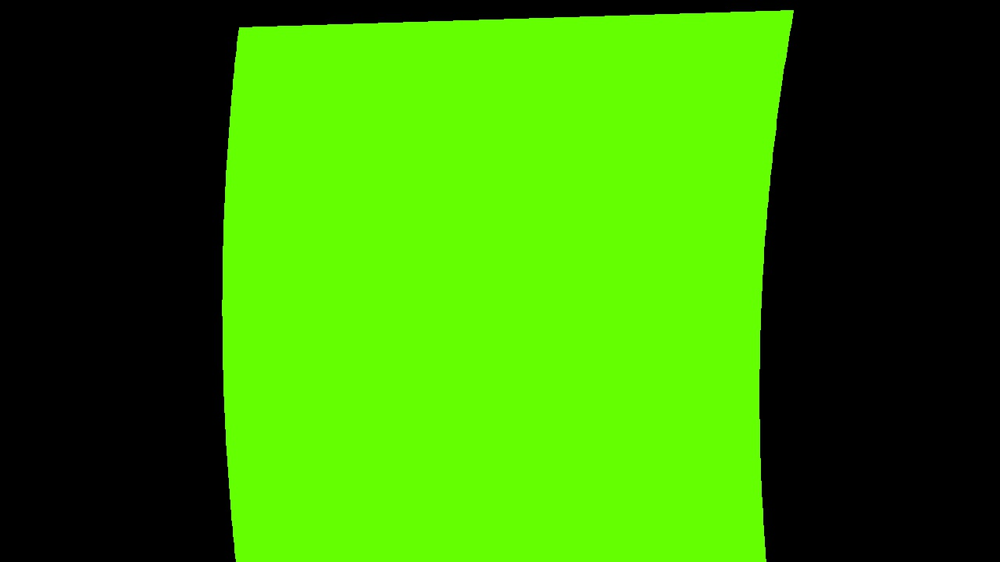        | 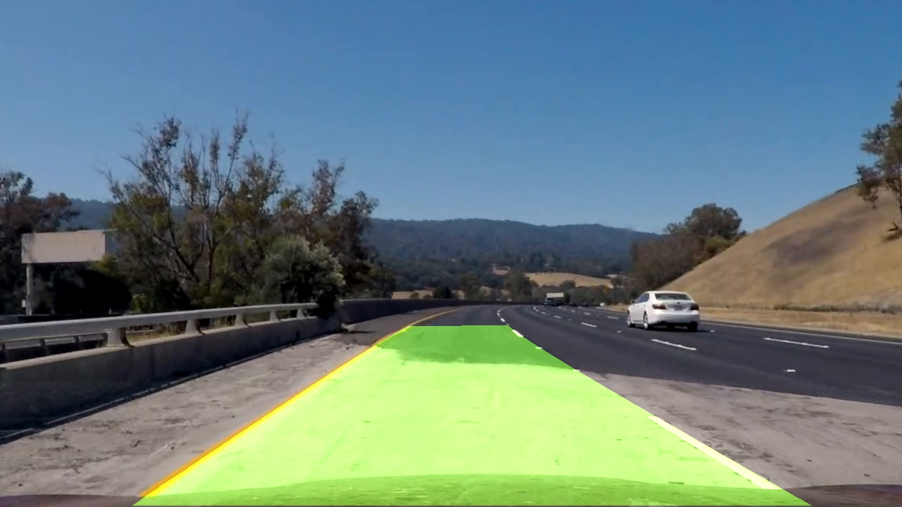        | 
|:-------------:|:-------------:|
| Detected lane region painted    | Perspective-warped and blended with original |

### Annotate image with lane curvature and vehicle position.

|        |
|:-------------:|
| Overall confidence (width AND parallel AND radius)   |

[Code](lane_finder.py#L545-L549)

# Video Processing

Video processing uses information from the previous frames to smooth predictions and optimize the single-image pipeline:
* For each frame:
   * Run the single-frame detection. If a recent frame provided a confident detection, run an optimized version using the previous detection as additional input. The optimization is simple - skip the full histogram search during lane line detection, and center the bottom band's search window around the lane positions from the previous detection.
   * Average the confident predictions over the last 10 frames to generate curve radius and lane position
   * I also wanted to average the lane line positions, so the lane region appears smoother o

Code [clip_processor.py](./clip_processor.py); [per-frame code](./clip_processor.py#L78-L102)

The video processor also generates some plots to show various metrics over the length of the video:
Left/right lane line curvature:
Left/right lane line polynomial linear coefficient
Left/right lane line polynomial square coefficient
Left/right lane line positions
Which frames did not have a recent confident prediction and performed a full histogram search
Inverse curve radius
Confident parallel
Confident radius
Confident lane width
Confident overall

Here's a [link to my video result](./project_video_out.mp4) TODO

---

###Discussion

####1. Briefly discuss any problems / issues you faced in your implementation of this project.  Where will your pipeline likely fail?  What could you do to make it more robust?

Here I'll talk about the approach I took, what techniques I used, what worked and why, where the pipeline might fail and how I might improve it if I were going to pursue this project further.  

