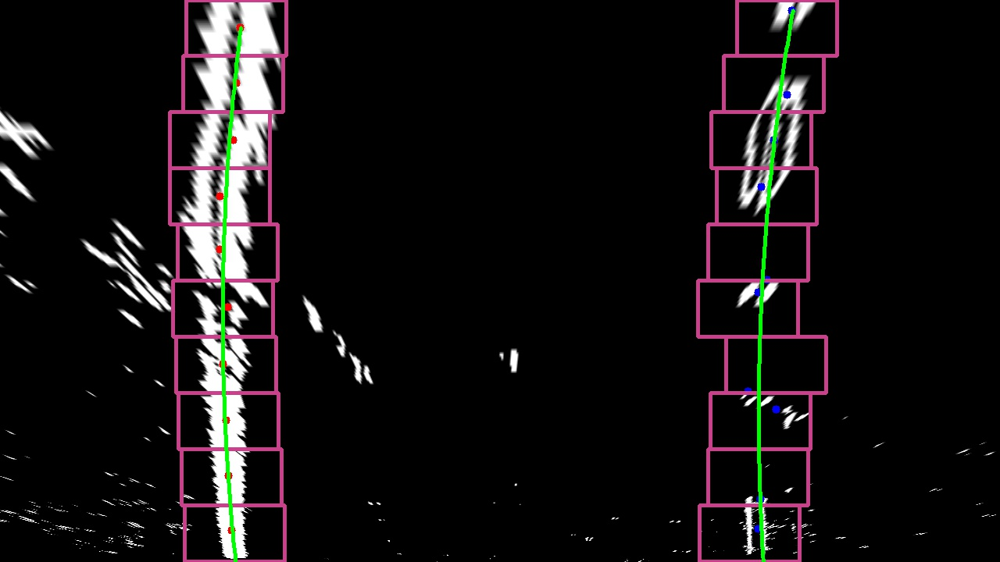
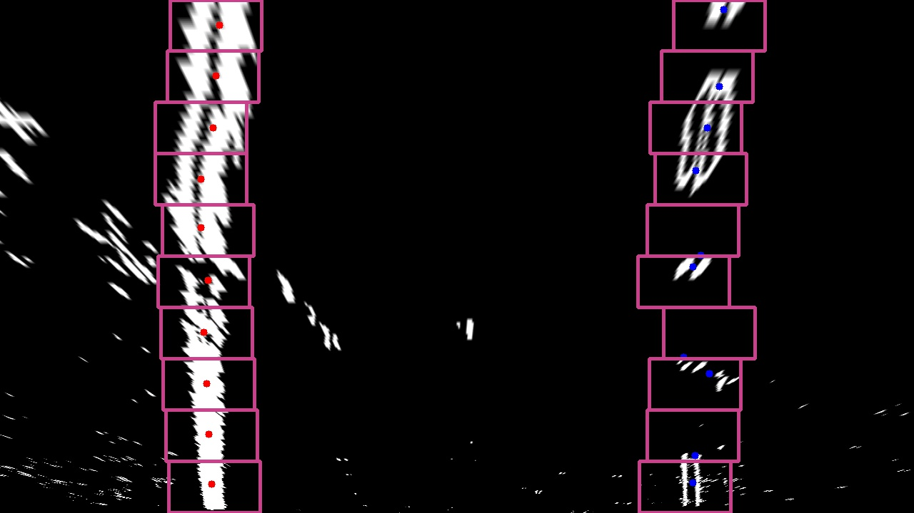

# Advanced Lane Finding Project 

This project uses computer vision techniques to detect lane information from a car's front-facing camera. Given a video clip, it produces an output video marked and annotated with lane info. I completed it as part of Udacity's Self-Driving Car Engineer nanodegree program.

There are two distinct layers of processing: a lane-finding pipeline for single images, and a video layer that leverages temporal coherence (i.e. detections from previous frames) to smooth the output and optimize the performance of the single image layer. 

# Single Image Processing 
### ([Source code](./lane_finder.py); [Main function](lane_finder.py#L384-L434).)

The single image processing pipeline can be summarized as follows:

|         |         |  
|:-------------:|:-------------:|:-------------:|
| 1. Undistort raw image     | 2. Detect lane separator "candidate pixels" | Generate a bird's-eye view |
|         |         |  
| 4. Fit lane separator lines   | 5. Calculate lane properties and annotate original image |

I was inspired by another Udacity student, [Patrick Esser](https://github.com/pesser/line_finder_explorer) to create an interactive UI for tweaking the pipeline's various parameters. Here is a short video demonstrating its use:

---
Each step is described in detail below.

### Prerequisite: Camera Calibration
#### [source code](./lane_finder.py#L466-L530)
Before processing images, we need to account for lens distortion introduced by the camera. OpenCV includes utilities for determining a camera's calibration parameters, which quantify the distortion effect. Since all the images are from the same camera, we only do this once.

cv2.calibrateCamera() calculates calibration parameters given a set of 3D points in world space and their corresponding 2D locations in the image. We use a chessboard pattern photographed from several angles to generate input as follows:
* 2D image points are detected by cv2.findChessboardCorners().
* 3D points are generated using a regular grid on the (x,y) plane, with z=0.

|         |         | 
|:-------------:|:-------------:|
| Original with corners detected      | Undistorted |

### Undistort raw image
#### [source code](./lane_finder.py#L89-L97)

We use cv2.undistort() to undistort the input image using the calibration parameters we calculated:

    cv2.undistort(img, cam_matrix, distortion_coefficients, None, cam_matrix)

|         |         | 
|:-------------:|:-------------:|
| Original      | Undistorted |

### Detect lane separator "candidate pixels"
#### [source code](./lane_finder.py#L399-L402)

We generate a binary image, turning on pixels that are good bets to be part of the lane separator lines.

|         |
|:-------------:|
| Candidate pixels are on      |

This image is obtained by combining three images using a binary OR:

|         |         |  
|:-------------:|:-------------:|:-------------:|
| A thresholded Sobel filter in the X direction on the grayscale image      | A thresholded Sobel filter in the X direction on the S channel of HLS color space | A threshold on the S channel of HLS color space |

Each of these identified some pixels that other components missed, so combining them together yeilded a better detection of candidate pixels. 

This is one of the weaker parts of my pipeline - it does the job on the project video but does not perform well on the challenge videos.

### Generate a bird's-eye view
#### [source code] (./lane_finder.py#L152-L199)
Now we perform a perspective warp to bring the binary image into a bird's eye view that can be used to find the lane lines. OpenCV's cv2.getPerspectiveTransform() can generate this transformation given a quadrilateral designating a plane on the source image and its desired location on the destination image:

|         |         | 
|:-------------:|:-------------:|
| perspective view with source quad     | bird's eye view with destination quad |

The source quadrilateral is hard coded based on a measurement of a typical frame from the video. Unfortunately the location of the source quad is extremely sensitive to small changes in the car's attitute (i.e. small bounces pointing the camera up or down). An incorrect source quad will cause the lane lines to appear skewed in the bird's eye view, which reduces our confidence in the detection: 

|        |
|:-------------:|
| Skewed lane lines caused by a bad perspective warp   |

### Find the left and right lane lines
[source code](./lane_finder.py#L202-L291)

NExt we search for the left and right lane lines:
* Generate a histogram along x axis for the bottom half of the image. The peaks of the histogram determine the starting x positions.

|        |
|:-------------:|
| Histogram of pixel values in each column of the bottom half of the image    |

* For each lane line (left and right):
  * Divide the image into ten horizontal bands. From the bottom, for each band:
    * Create search window centered horizontally above the the previous band's detection (or histogram peak for the bottom band)
    * Calculate the center of mass of white pixels in the search window
    * Add the center of mass to a list of points

|        |
|:-------------:|
| Lane line points detected by calculating the center of mass of stacked search windows    |

  * Fit a second degree polynomial to all the detected points
 
|        |
|:-------------:|
| Second degree polynomials fitted to detected points    |

### Determine the curvature and vehicle position
In order to convert pixel measurements into meters we divide known distances by manually measured pixel distances in the top-down view:

    # meters per pixel in y dimension (9.14m is the distance between dashes on a lane line)
    ym_per_pix = 9.14 / 230 
    # meters per pixel in x dimension (3.7m is the width of a lane)
    xm_per_pix = 3.7 / 640  

The vehicle's position in the lane is determined by comparing the lane's horizontal center to that of the image:

    def calculate_center_offset(self, image_width):
        pixel_offset = (self.right_line.x_pixels + self.left_line.x_pixels - image_width) / 2
        self.center_offset = pixel_offset * self.left_line.x_meters_per_pixel
        
The curvature radius at a particular point in a polynomial can be calculated using [this method](http://www.intmath.com/applications-differentiation/8-radius-curvature.php):

        self.radius_of_curvature = \
            ((1 + (2 * polynomial[0] * self.bottom_y_meters +
                   polynomial[1]) ** 2) ** 1.5) \
                / np.absolute(2 * polynomial[0])
        
To calculate the curve radius for the lane, we average the left and right curvature radius. This value is only considered valid in the case of a confident detection (see below). If the left and right curvatures are above a threshold, we consider it a straightaway with infinite radius.

The curvature radius calculation is extremely sensitive to the correctness of the perspective warp, so it bounces around quite a bit in reaction to minor changes in the car's pitch. Here is the inverse of the curve radius over the course of the video. Notice the sporadic incorrect "straightaway" determinations near the end, and the constant fluctuations throughtout:

|        |
|:-------------:|
| 1 / lane curve radius   |

### Perform a confidence check on the detection
#### [source code ](./lane.py#L75-L100)
For a detection to be considered confident, its lane lines must be:
* Roughly 3.7 meters apart (per US standards). Here's a plot of the left and right lane line positions and confidence over the entire video clip:

|        |        |
|:-------------:|:-------------:|
| Left and right lane line positions   | Binary confidence decision based on lane width

* Roughly parallel (2nd and 1st order polynomial coefficients are within a threshold). I determined reasonable thresholds by eyeballing a plot of the left and right polynomial coefficients over the length of an entire video clip:

 |         |         |          |
|:-------------:|:-------------:|:-------------:|
| Linear coefficients      | Square coefficients | Binary confidence decision based on polynomical coefficients |

* Roughly the same curvature radius. Since the turn radius bounces around so much, I considered radii within a factor of 2 to be roughly the same. More confidence in the perspective warp would allow us to tighten that up quite a bit and reduce the noise in this signal:

|        | |
|:-------------:|:-------------:|
| Left and right lane line curvature   | Binary confidence decision based on similar curve radius   |

|        |
|:-------------:|
| Overall confidence (width AND parallel AND radius)   |

### Warp back onto the original image.
The region between the left and right lane lines gets painted and warped back as if it is seen from the front-facing camera (again using cv2.getPerspectiveTransform() but this time with reversed source and destination quadrilaterals)

|         |         | 
|:-------------:|:-------------:|
| Detected lane region painted    | Perspective-warped and blended with original |

### Annotate image with lane curvature and vehicle position.
#### [source code](lane_finder.py#L551-L555)

|        |
|:-------------:|
| Final annotated image  |

# Video Processing
#### [source code](./clip_processor.py); [per-frame code](./clip_processor.py#L78-L102)
Video processing uses information from the previous frames to smooth predictions and optimize the single-image pipeline:
* For each frame:
   * Run the single-frame detection. If a recent frame provided a confident detection, run an optimized version using the previous detection as additional input. The optimization is simple - skip the full histogram search during lane line detection, and center the bottom band's search window around the lane positions from the previous detection.
   * Average the confident predictions over the last 10 frames to generate curve radius and lane position
   * I also wanted to average the lane line positions, so the lane region changes more fluidly between frames in the output video, but I ran out of time!

Here's my video result: 

---

###Discussion

It was interesting working on this project, especially after using deep learning to tackle a related problem on the [previous project](https://github.com/gilcarmel/behavioral). It's easy to see why deep learning is revolutionizing the field. While computer vision techniques are an appropriate tool for this relatively constrained task, the solution feels like a stack of heuristics chained together. Reaching a robust solution would no doubt require many more of these heuristics and could grow intractable; while a properly trained deep learning model could solve this type of problem in a relatively elegant, and possibly more perofrmant way.

The main problems in my implementation (and suggestions for improvement) can be summarized as follows:
* Filters for determining lane-line pixel candidates are not robust enough. They fail miserably on the challenge videos which introduce different lighting and road conditions. Some more experimentation is needed to help reject shadow lines, use known lane width as a clue, color balance the input image, etc. A more advanced UI for interactively tweaking algorithm parameters on a set of test images would be a huge help here.
* The hard-coded perspective warp is extremely unreliable and yields a lot of bad projections. A possible solution for video processing is to perform plane detection across consecutive video frames. Once the road's plane equation relative to the camera is determined, the perspective warp can be made more reliable. This would also help the detection on sloped roads.
* An automated test bed could be useful to ensure that algorithm improvements for a single difficult image do not adversely affect the detection in a full suite of test images.

